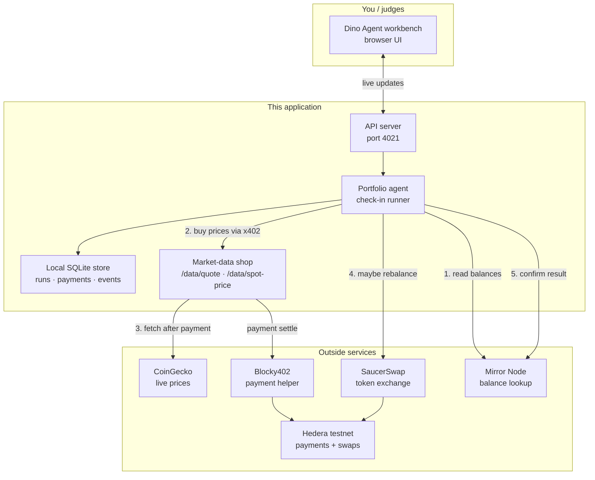
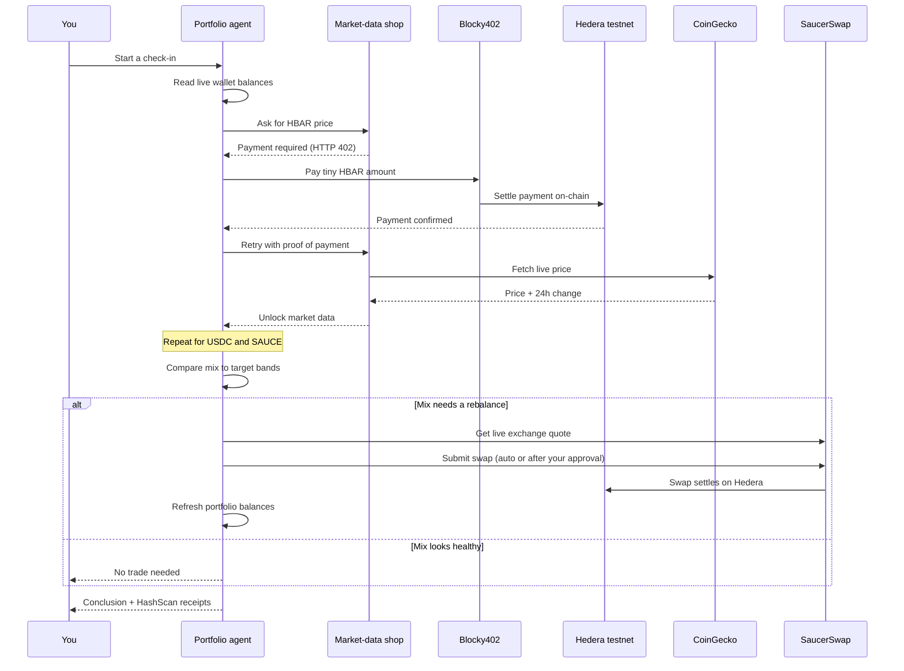

# Dino Agent

**An AI portfolio agent that pays for live market data per call — settled on Hedera.**

Built for the [Hedera x402 bounty](https://hedera.com/x402-bounty/) (reference architecture 1: *an agent that pays per query*).

Dino Agent watches a small portfolio (HBAR, USDC, SAUCE), buys only the prices it needs through **x402 micropayments on Hedera testnet**, explains what it sees in plain language, and can rebalance on SaucerSwap when the mix drifts outside target bands.

No yearly data subscription. No API key for the agent to manage. Each paid read has an on-chain receipt.

---

## Why this exists

Software agents are starting to buy services the way people buy apps — one call at a time.

**x402** reuses the HTTP **402 Payment Required** status so a server can say: “this data costs a tiny amount — pay, then retry.” On Hedera those payments settle quickly at a fixed, predictable fee, which makes pay-per-use realistic.

This project is a full loop:

1. Read live balances  
2. Pay for prices  
3. Decide  
4. Optionally trade  
5. Refresh the portfolio  
6. Show proof  

---

## Quick start

Needs **Node.js 20+**.

```bash
git clone <your-fork-url>
cd marketrail-x402   # or your repo folder name
npm ci
cp .env.example .env
cp web/.env.example web/.env
```

Fill `.env` with:

| Variable | Meaning |
|---|---|
| `HEDERA_CLIENT_ID` / `HEDERA_CLIENT_KEY` | Funded Hedera **testnet** account the agent uses to pay (and for Mode 4 trades) |
| `PAY_TO_ACCOUNT` | A **different** testnet account that receives data payments |
| `DATA_PROVIDER=market` | Use live CoinGecko behind the paywall (`mock` for offline demos) |
| `FACILITATOR_URL` | Default: `https://api.testnet.blocky402.com` |

Optional for wallet approval mode: set `PUBLIC_REOWN_PROJECT_ID` in `web/.env` (from [Reown](https://dashboard.reown.com/)).

Create a separate receiver account (same key, new ID) if you need one:

```bash
npx tsx scripts/create-receiver.ts
```

Run the stack from the repo root:

```bash
# Terminal 1 — API (http://localhost:4021)
npm start

# Terminal 2 — workbench UI (http://localhost:4321)
npm run web:dev
```

Open **http://localhost:4321/connect**, pick how money should move, then open the workspace.

Useful checks:

```bash
npm test              # offline unit tests
npm run preflight     # external services before a demo
npm run e2e           # one real paid x402 call + HashScan proof
```

---

## Demo script for judges

A spoken, under-five-minute narration lives here:

**[docs/DEMO_SCRIPT.md](docs/DEMO_SCRIPT.md)**

Technical rehearsal notes: **[docs/DEMO.md](docs/DEMO.md)**  
Submission checklist: **[docs/SUBMISSION_CHECKLIST.md](docs/SUBMISSION_CHECKLIST.md)**

---

## Architecture

### Big picture

The browser talks to our API. The portfolio agent buys prices from our own **market-data shop** (paywalled with x402). After payment settles on Hedera, the shop fetches live prices from CoinGecko and returns them. If a rebalance is needed, the agent uses SaucerSwap on Hedera and then refreshes balances.


<details>
<summary>Mermaid source (renders on GitHub)</summary>



</details>

### One check-in, step by step


<details>
<summary>Mermaid source</summary>



</details>

### Onboarding: choose custody first


| Path | What it means |
|---|---|
| **I approve each trade** | Connect your wallet. Modes 1–3: watch, advise, or propose. Mode 3 prompts your wallet before funds move. |
| **Agent runs alone** | Fund the server treasury. Mode 4 trades inside your limits without asking every time. |

Switching between “my wallet” and “agent treasury” is done from `/connect`, not mid-chat — each path uses a different account.

---

## What happens in a successful cycle

1. **Read holdings** from Hedera Mirror Node.  
2. **Buy prices** for HBAR, USDC, and SAUCE — each call is a separate x402 payment.  
3. **Think out loud** in the UI (plain language insights from the paid feed).  
4. **Compare** the mix to target bands (for example: HBAR should stay under a ceiling).  
5. **Trade** only if policy allows — either wait for your wallet approval (Mode 3) or auto-submit from the agent treasury (Mode 4).  
6. **Refresh** portfolio dollars and percentages from live balances after a successful swap.  
7. **Persist** every event so the stream and HashScan links survive a refresh.

Safety defaults:

- Trades are size-capped (about 5% of a sleeve / 10 HBAR atomic cap).  
- Fallback / non-live prices are labeled and **cannot** authorize a trade.  
- A global halt switch stops new work.  
- The server never uses a plain HBAR transfer as a fake “swap.”

---

## Folder structure

```text
marketrail-x402/
├── README.md                 ← you are here
├── package.json              ← API + scripts (npm workspaces)
├── .env.example              ← API / agent secrets template
├── docs/
│   ├── DEMO_SCRIPT.md        ← spoken demo narration
│   ├── DEMO.md               ← technical rehearsal notes
│   ├── SUBMISSION_CHECKLIST.md
│   └── diagrams/             ← architecture PNGs + Mermaid sources
├── scripts/
│   ├── e2e-pay.ts            ← one live paid call + proof
│   ├── preflight.ts          ← check external services
│   ├── x402-sign.ts          ← delegated payment signer
│   ├── create-receiver.ts    ← make a PAY_TO account
│   └── demo-*.mjs            ← optional Playwright recordings
├── src/                      ← API + agent (TypeScript)
│   ├── agent/                ← check-in runner, thoughts, insights
│   ├── core/                 ← config, catalog, facilitator wiring
│   ├── portfolio/            ← live balances + band math
│   ├── providers/
│   │   ├── market/           ← CoinGecko-backed data (after payment)
│   │   └── mock/             ← offline deterministic data
│   ├── trading/              ← quotes, policy, SaucerSwap execution
│   ├── store/                ← SQLite runs, events, proposals
│   ├── scheduler/            ← timed check-ins
│   └── server/               ← HTTP API + SSE stream
├── test/                     ← Vitest unit / API tests
└── web/                      ← Astro + React workbench UI
    ├── .env.example
    ├── src/components/       ← workspace, thoughts, graph, connect
    ├── src/lib/              ← API client, wallet connect / sign
    └── e2e/                  ← Playwright UI tests
```

Swap the data backend in one place: `src/providers/index.ts`.  
Swap the payment helper with `FACILITATOR_URL`.

---

## Market-data catalog

These are the products the agent can buy. Unpaid calls return **HTTP 402**.

| Product | What you get | Price |
|---|---|---|
| `spot-price` | Live USD price | 0.01 HBAR |
| `quote` | Price + 24h change + volume (preferred for decisions) | 0.02 HBAR |
| `ohlc` | Candle for a date | 0.05 HBAR |

See the live list at `GET http://localhost:4021/catalog`.

### About CoinGecko

CoinGecko provides the **numbers**. Our server provides the **paywall**:

- Without payment → 402  
- With a settled Hedera micropayment → live price unlocked  

That is intentional for this bounty: judges look for real x402 payments on **Hedera rails**. (CoinGecko also offers its own x402 endpoints elsewhere, but those settle on other networks today.)

---

## Main API surface

| Endpoint | Purpose |
|---|---|
| `GET /api/health` | Ready? (no secrets) |
| `GET /api/v1/onboarding` | Custody / treasury status |
| `POST /api/v1/onboarding/complete` | Finish setup (modes 1–4) |
| `GET /api/v1/profiles/:id/dashboard` | Portfolio, runs, events |
| `POST /api/v1/profiles/:id/runs` | Start a check-in |
| `GET /api/v1/profiles/:id/stream` | Live event stream (SSE) |
| `POST /api/v1/proposals/:id/approve` | Approve a trade (wallet or agent) |
| `POST /api/v1/proposals/:id/confirm` | Confirm a wallet-signed swap |
| `POST /api/v1/system/halt` | Emergency stop |

---

## Manual payment smoke test

Prove the paywall without the UI:

```bash
URL="http://localhost:4021/data/spot-price?symbol=HBAR"

PR=$(curl -s -D - -o /dev/null "$URL" \
  | grep -i '^payment-required:' | sed 's/^[^:]*:[[:space:]]*//' | tr -d '\r')

SIG=$(printf '%s' "$PR" | npx tsx scripts/x402-sign.ts)

curl -s -i "$URL" -H "payment-signature: $SIG"
```

You should see HTTP 200 and a `payment-response` header with a Hedera transaction id.

---

## Example on-chain proofs (Hedera testnet)

Replace these with fresh links from your own `npm run e2e` / demo run before submitting.

| What | Example |
|---|---|
| Paid HBAR intelligence | [HashScan](https://hashscan.io/testnet/transaction/0.0.7162784-1785493884-281733761) |
| Paid USDC intelligence | [HashScan](https://hashscan.io/testnet/transaction/0.0.7162784-1785493890-941770239) |
| Paid SAUCE intelligence | [HashScan](https://hashscan.io/testnet/transaction/0.0.7162784-1785493898-759696230) |
| SaucerSwap rebalance | [HashScan](https://hashscan.io/testnet/transaction/0.0.6255888-1785493939-647708643) |

---

## Safety notes for judges and operators

- Use **testnet** funds only.  
- Never commit `.env` or paste private keys into the UI, chat, or screenshots.  
- Local SQLite state lives in `data/` (gitignored).  
- Single-host demo design — not a multi-region production deployment.  
- Public CoinGecko can rate-limit; fallbacks are labeled and blocked from trading.

---

## License

[MIT](LICENSE)
