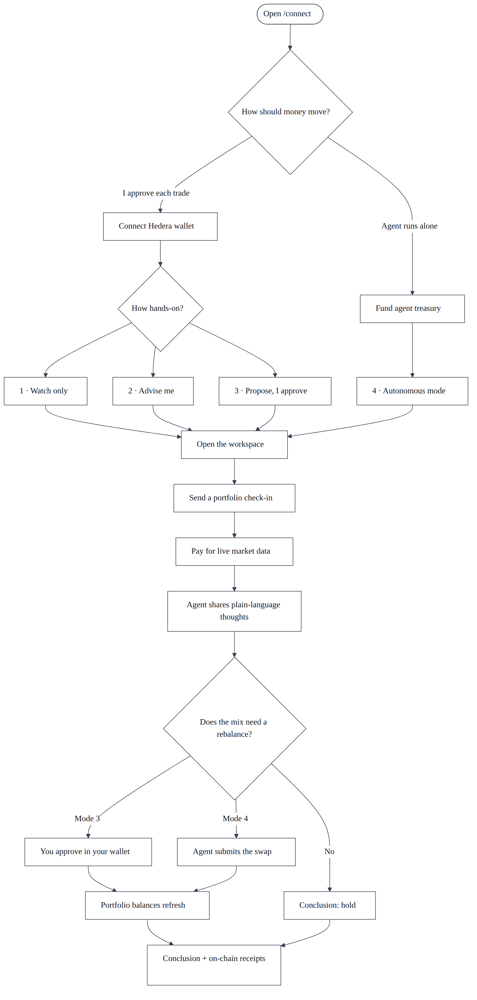
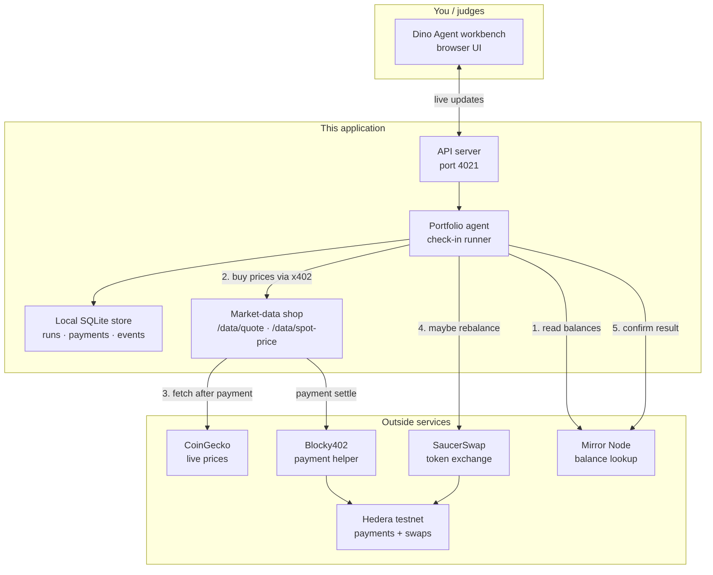
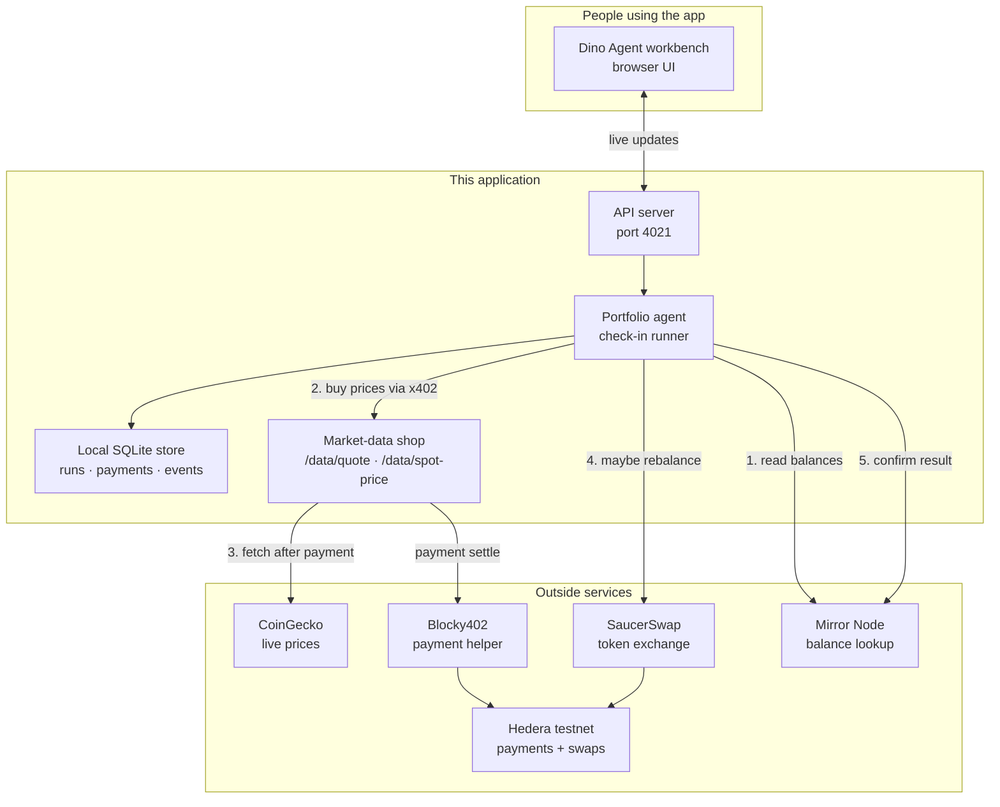
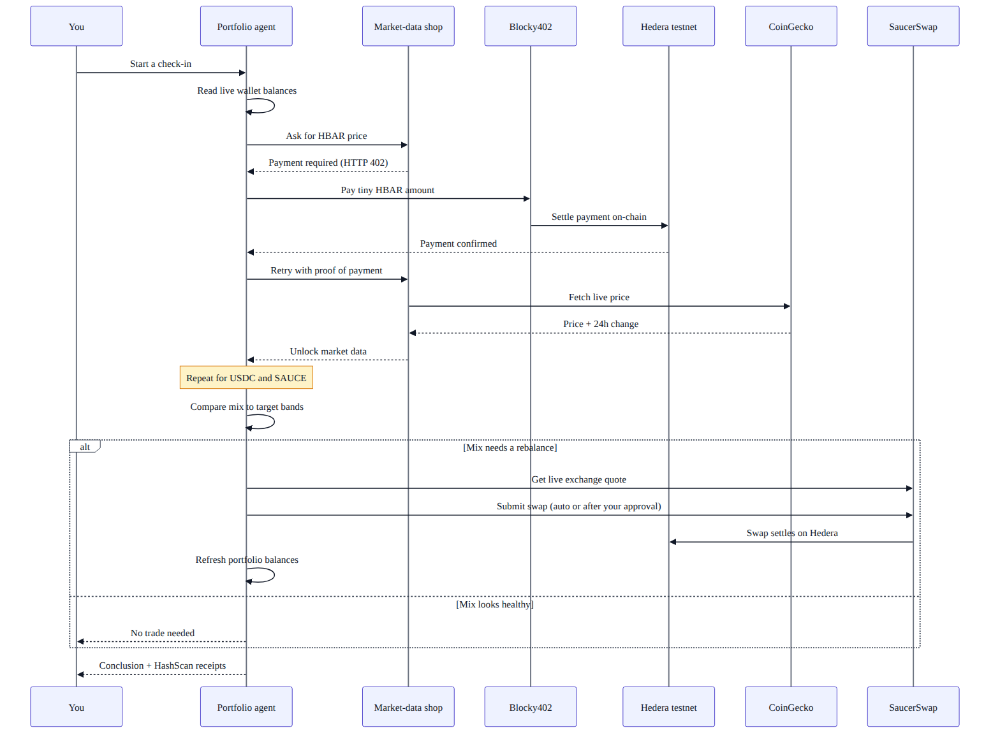
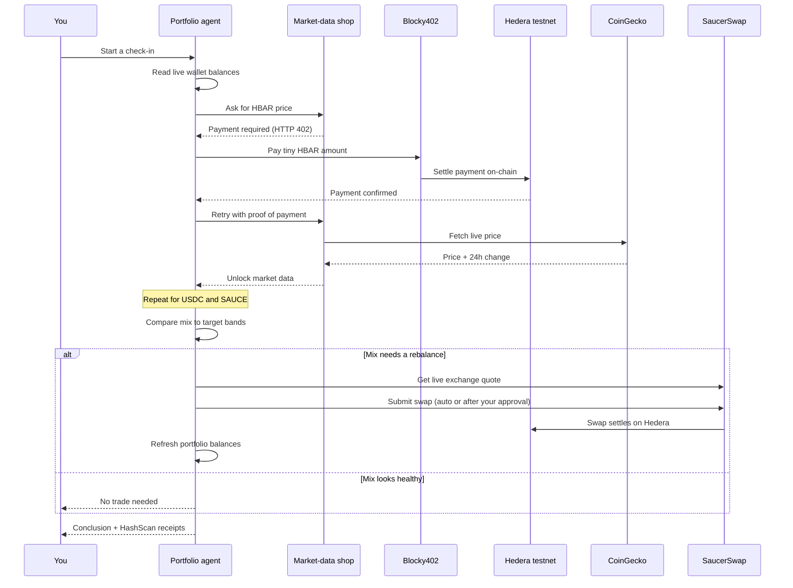

# Dino Agent

An AI portfolio agent that **pays for live market data one call at a time**, settles those payments on **Hedera testnet**, and helps you keep a small HBAR / USDC / SAUCE mix on track.

“Managing the portfolio” here means: **watch holdings → buy fresh prices when needed → explain what changed → decide whether to hold or rebalance** (and only then trade, if your mode allows it).

Built from the Hedera x402 “agent pays per query” starting point.

---

## What you get

When you open the workbench you can:

1. Choose how money should move (your wallet approves each trade, or a funded agent treasury runs on its own).
2. Pick how hands-on the agent should be (see modes below).
3. Send a short request like “check my mix” or “buy fresh prices and tell me what you’d do.”
4. Watch the agent:
   - read live balances  
   - **pay** for HBAR, USDC, and SAUCE prices (unless observe-only)  
   - share plain-language thoughts and a clear conclusion  
   - **hold** when bands look fine, or **propose / submit a rebalance** when they don’t  
   - refresh the portfolio after a successful swap  
5. Open HashScan links for every paid read and every swap.

No yearly data subscription. Each paid price has its own on-chain receipt.

### What the agent can do (by mode)

| Mode | Buys market data? | Trades? | What you see |
|---|---|---|---|
| **1 · Watch only** | No | No | Live balances recorded; no spend, no trade |
| **2 · Advise me** | Yes | No | Paid prices + recommendation; nothing executes |
| **3 · Propose, I approve** | Yes | Only after you approve in your wallet | Full check-in; swap waits on your confirmation |
| **4 · Autonomous** | Yes | Yes, inside your limits | Full check-in; agent can rebalance from the treasury |

So a healthy cycle often ends with **“no trade needed.”** That still counts: the agent paid for data, judged the mix, and chose to hold.

---

## Quick start

Needs **Node.js 20+**.

```bash
git clone <your-fork-url>
cd marketrail-x402
npm ci
cp .env.example .env
cp web/.env.example web/.env
```

### Fill `.env`

| Variable | What it is |
|---|---|
| `HEDERA_CLIENT_ID` / `HEDERA_CLIENT_KEY` | Funded Hedera **testnet** account used to pay for data (and to trade in autonomous mode) |
| `PAY_TO_ACCOUNT` | A **different** testnet account that receives those data payments |
| `DATA_PROVIDER=market` | Live CoinGecko behind the paywall (`mock` for offline testing) |
| `FACILITATOR_URL` | Payment helper — default `https://api.testnet.blocky402.com` |

For “approve in wallet” mode, also set `PUBLIC_REOWN_PROJECT_ID` in `web/.env` (from [Reown](https://dashboard.reown.com/)).

Need a separate receiver account?

```bash
npx tsx scripts/create-receiver.ts
```

### Run it

```bash
# Terminal 1 — API
npm start
# → http://localhost:4021

# Terminal 2 — UI
npm run web:dev
# → http://localhost:4321
```

Open **http://localhost:4321/connect**, pick a path, then use the workspace.

```bash
npm test           # offline tests
npm run preflight  # check outside services
npm run e2e        # one real paid call + HashScan proof
```

---

## Deployment (Vercel & Railway)

This repository is designed for a split deployment architecture:
1. **Frontend (Vercel)**: Import the repository, set the root directory to `web`, and configure:
   - `PUBLIC_API_URL`: The URL of your deployed backend (e.g., `https://x402-hedera-web-production.up.railway.app`).
   - `PUBLIC_REOWN_PROJECT_ID`: Your Reown project ID.
2. **Backend (Railway)**: Deploy the root of the repository to Railway and configure:
   - `FRONTEND_URL`: The URL of your Vercel deployment (e.g., `https://dino-x402-web.vercel.app`) to strictly allow CORS.
   - `PORT`: (e.g., `4021`)
   - Your Hedera credentials (`HEDERA_CLIENT_ID`, `HEDERA_CLIENT_KEY`, `PAY_TO_ACCOUNT`).
   - `DATA_PROVIDER` (e.g., `market`).

*Note: The SQLite database (`data/agent.sqlite`) is re-created as a fresh slate in the cloud.*

---

## How the product feels

### First visit: choose custody

On `/connect` you answer one question first: **how should money move?**

| Choice | What happens |
|---|---|
| **I approve each trade** | Connect your Hedera wallet. Then pick how hands-on you want to be (watch, advise, or propose-and-approve). Nothing leaves your account until you confirm in the wallet app. |
| **Let the agent run on its own** | Fund the server-managed treasury. The agent can trade inside your limits without asking every time. |

That choice is made up front on purpose. Each path uses a different account, so switching mid-chat would be confusing.



### Inside the workspace

- **Left:** live holdings and recent runs  
- **Center:** the activity stream — payments, thoughts, trades, conclusion  
- **Right (Graph):** prices the agent paid to unlock, with markers on those moments  
- **Bottom:** send a check-in in everyday language  

After a successful swap, balances and mix percentages refresh from live holdings.

---

## Architecture

### Big picture

The browser talks to our API. The portfolio agent buys prices from our own **market-data shop** (paywalled with x402). After payment settles on Hedera, the shop fetches live prices from CoinGecko and returns them. If a rebalance is needed, the agent uses SaucerSwap on Hedera, then refreshes balances.



<details>
<summary>Editable Mermaid source</summary>



</details>

### One check-in, step by step

This is the heart of the loop: ask for a price → get “payment required” → pay on Hedera → unlock data → decide → maybe swap → refresh.



<details>
<summary>Editable Mermaid source</summary>



</details>

---

## What happens in a successful cycle

1. **Read holdings** from Hedera Mirror Node.  
2. **Buy prices** for HBAR, USDC, and SAUCE — each call is its own small payment.  
3. **Think out loud** in the UI using the paid feed.  
4. **Compare** the mix to target bands (for example: HBAR should stay under a ceiling).  
5. **Trade** only if safety checks pass — wallet approval (Mode 3) or agent treasury (Mode 4).  
6. **Refresh** portfolio dollars and percentages from live balances after a successful swap.  
7. **Keep** every step so the stream and receipt links survive a page refresh.

Guards built in:

- Trade size caps (about 5% of a sleeve / 10 HBAR max per atomic move)  
- Non-live / fallback prices are labeled and **cannot** authorize a trade  
- Global halt switch  
- No plain HBAR transfer pretending to be a swap  

---

## Folder structure

```text
marketrail-x402/
├── README.md
├── package.json              ← API + scripts (npm workspaces)
├── .env.example              ← API / agent settings template
├── docs/
│   ├── diagrams/             ← architecture images + Mermaid sources
│   └── SUBMISSION_CHECKLIST.md
├── scripts/
│   ├── e2e-pay.ts            ← one live paid call + proof
│   ├── preflight.ts          ← check outside services
│   ├── x402-sign.ts          ← signs a payment challenge locally
│   └── create-receiver.ts    ← create a PAY_TO account
├── src/                      ← API + agent
│   ├── agent/                ← check-in runner and thoughts
│   ├── core/                 ← config, catalog, payment wiring
│   ├── portfolio/            ← live balances + target bands
│   ├── providers/
│   │   ├── market/           ← CoinGecko data (after payment)
│   │   └── mock/             ← offline fake data
│   ├── trading/              ← quotes, safety checks, SaucerSwap
│   ├── store/                ← SQLite runs, events, proposals
│   ├── scheduler/            ← timed check-ins
│   └── server/               ← HTTP API + live event stream
├── test/
└── web/                      ← Astro + React workbench
    ├── .env.example
    ├── src/components/
    ├── src/lib/              ← API client, wallet connect / sign
    └── e2e/
```

Change the data backend in `src/providers/index.ts`.  
Change the payment helper with `FACILITATOR_URL`.

---

## Market-data catalog

Unpaid calls return **HTTP 402 Payment Required**.

| Product | What you get | Price |
|---|---|---|
| `spot-price` | Live USD price | 0.01 HBAR |
| `quote` | Price + 24h change + volume (used for decisions) | 0.02 HBAR |
| `ohlc` | Candle for a date | 0.05 HBAR |

Live list: `GET http://localhost:4021/catalog`

### About CoinGecko

CoinGecko supplies the **numbers**. This app supplies the **paywall**:

- No payment → 402  
- Settled Hedera micropayment → live price unlocked  

You could call CoinGecko’s free HTTP API directly, but then there would be no Hedera payment story. Here the agent pays our market-data shop on Hedera; the shop then fetches CoinGecko after settlement.

---

## Useful API routes

| Endpoint | Purpose |
|---|---|
| `GET /api/health` | Is the server ready? (no secrets) |
| `GET /api/v1/onboarding` | Custody / treasury status |
| `POST /api/v1/onboarding/complete` | Finish setup (modes 1–4) |
| `GET /api/v1/profiles/:id/dashboard` | Portfolio, runs, events |
| `POST /api/v1/profiles/:id/runs` | Start a check-in |
| `GET /api/v1/profiles/:id/stream` | Live event stream |
| `POST /api/v1/proposals/:id/approve` | Approve a trade |
| `POST /api/v1/proposals/:id/confirm` | Confirm a wallet-signed swap |
| `POST /api/v1/system/halt` | Emergency stop |

---

## Prove a payment without the UI

```bash
URL="http://localhost:4021/data/spot-price?symbol=HBAR"

PR=$(curl -s -D - -o /dev/null "$URL" \
  | grep -i '^payment-required:' | sed 's/^[^:]*:[[:space:]]*//' | tr -d '\r')

SIG=$(printf '%s' "$PR" | npx tsx scripts/x402-sign.ts)

curl -s -i "$URL" -H "payment-signature: $SIG"
```

Expect HTTP 200 and a `payment-response` header with a Hedera transaction id.

---

## Example on-chain receipts (Hedera testnet)

Replace with fresh links from your own `npm run e2e` or UI run before sharing.

| What | Example |
|---|---|
| Paid HBAR price | [HashScan](https://hashscan.io/testnet/transaction/0.0.7162784-1785493884-281733761) |
| Paid USDC price | [HashScan](https://hashscan.io/testnet/transaction/0.0.7162784-1785493890-941770239) |
| Paid SAUCE price | [HashScan](https://hashscan.io/testnet/transaction/0.0.7162784-1785493898-759696230) |
| SaucerSwap rebalance | [HashScan](https://hashscan.io/testnet/transaction/0.0.6255888-1785493939-647708643) |

---

## Safety

- Use **testnet** funds only.  
- Never commit `.env` or paste private keys into the UI, chat, or screenshots.  
- Local SQLite files live under `data/` (gitignored).  
- This is a single-host demo, not a multi-region production setup.  
- Public CoinGecko can rate-limit; fallbacks are labeled and blocked from trading.

---

## License

[MIT](LICENSE)
