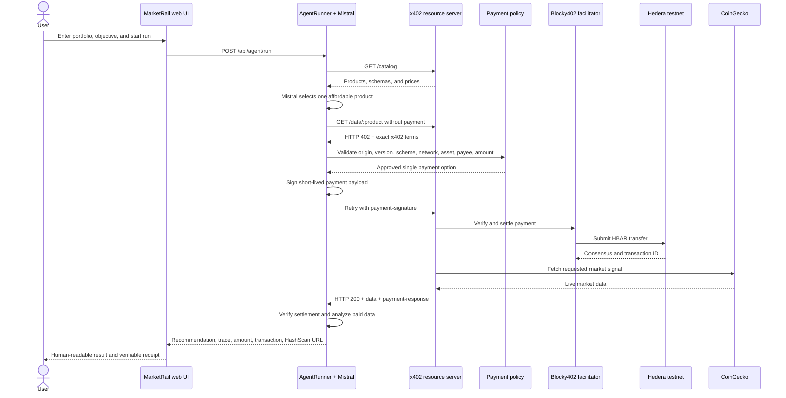

# MarketRail product brief

**Product:** MarketRail  
**Category:** Autonomous agent commerce / pay-per-query financial data  
**Protocol:** x402 v2  
**Settlement rail:** Hedera testnet  
**Payment asset currently implemented:** HBAR (`0.0.0`)  
**AI provider:** Mistral  
**Market-data provider:** CoinGecko, with a clearly labelled deterministic fallback  
**Current implementation status:** Working end to end with real Hedera testnet settlements  

---

## 1. Executive summary

MarketRail is an autonomous portfolio-analysis agent that can purchase market data on demand. A user supplies a portfolio, an objective, and a spending boundary. The agent discovers the available data products, uses Mistral to choose the most appropriate affordable product, requests it from an x402-protected API, receives an HTTP `402 Payment Required` response, validates the payment terms, signs the payment inside a server-side key boundary, settles HBAR on Hedera testnet, receives the purchased data, and returns a portfolio recommendation with an independently verifiable HashScan receipt.

The core product proposition is:

> Give software the ability to buy exactly the information it needs, at the moment it needs it, without a subscription, invoice, user account, or manual checkout.

MarketRail implements the first Hedera x402 bounty reference architecture: an agent that pays per market-data query. It is not a simulated checkout. Successful runs create real transfers on Hedera testnet.

The system currently contains five connected product surfaces:

1. **The MarketRail portfolio agent** — the end-user application that decides what data to buy and produces a recommendation.
2. **The x402 market-data marketplace** — a machine-readable catalog and protected data API.
3. **Three billable data products** — `spot-price`, `quote`, and `ohlc`, each with an exact HBAR price.
4. **Agent and developer integration surfaces** — catalog discovery, x402 headers, JSON APIs, `llms.txt`, and reusable provider contracts.
5. **Operations and proof tooling** — preflight checks, end-to-end payment verification, mirror-node validation, HashScan links, tests, and demo documentation.

---

## 2. The problem MarketRail solves

Most commercial data services assume a human or company will:

- create an account;
- receive an API key;
- select a monthly or annual plan;
- add a card or execute a contract;
- accept minimum spend requirements;
- reconcile usage and invoices later.

That workflow is poorly suited to autonomous agents. An agent may need one quote for one decision and never need that data source again. Giving every agent a collection of prepaid subscriptions is expensive, operationally cumbersome, and difficult to audit.

MarketRail changes the purchasing model from **access first, billing later** to **price discovery and settlement inside the request itself**.

The HTTP interaction becomes:

```text
Agent needs information
        ↓
Agent discovers a priced data product
        ↓
Agent requests the protected resource
        ↓
API returns HTTP 402 with exact payment terms
        ↓
Agent policy approves or rejects the terms
        ↓
Approved payment settles on Hedera
        ↓
API returns the purchased data
        ↓
Agent uses the data to complete its task
```

This makes an individual API response a purchasable digital product.

---

## 3. Competition-brief alignment

### 3.1 Reference architecture alignment

The bounty's first reference architecture describes an AI portfolio agent that buys live market data per call and settles each purchase on Hedera. MarketRail implements that exact pattern:

- the acting software is an AI-assisted portfolio agent;
- the purchased resource is market data;
- prices are advertised per API call;
- unpaid requests receive HTTP 402;
- the payment format is x402 v2;
- the payment uses the `exact` scheme;
- the settlement network is `hedera:testnet`;
- the current payment asset is HBAR;
- successful purchases create real testnet transfers;
- each result includes a transaction ID and HashScan link;
- the full flow is exposed in a demo-ready web interface;
- the implementation is published in a public MIT-licensed repository.

### 3.2 Autonomous commerce alignment

MarketRail demonstrates software paying software. After the user starts a run and establishes a maximum spend, the agent automatically:

1. discovers the catalog;
2. chooses a product;
3. supplies the product parameters;
4. requests the resource;
5. reads the 402 terms;
6. validates the proposed charge;
7. authorizes the payment;
8. retries the request with the signed x402 payload;
9. verifies settlement;
10. consumes the purchased data;
11. produces a recommendation.

There is no wallet popup or human approval between those steps. The autonomy is bounded by deterministic payment policy rather than unrestricted control of the payer account.

### 3.3 Hedera alignment

Hedera is used as the actual settlement rail, not simply referenced in the interface. The implementation:

- uses Hedera testnet account identifiers;
- creates an ECDSA Hedera signer;
- registers the x402 exact Hedera client and server schemes;
- settles HBAR transfers;
- verifies the settlement response returned by x402;
- generates a native HashScan transaction URL;
- independently checks the transaction through the Hedera mirror node;
- verifies the exact buyer debit and seller credit.

### 3.4 Demonstrability

The product is designed so a judge can see both the user outcome and the underlying protocol:

- a clear user objective and portfolio;
- a visible spending cap;
- an animated payment trace;
- the dataset selected by the agent;
- the exact HBAR amount spent;
- the recommendation produced from the purchased data;
- the native transaction ID;
- a direct HashScan link;
- an expandable JSON response containing the complete sanitized event trace.

---

## 4. Product portfolio

### 4.1 Product A: MarketRail autonomous portfolio agent

This is the primary user-facing product. It turns a portfolio question into a controlled autonomous purchase and analysis cycle.

#### Inputs

The agent accepts:

- **Objective:** free-form text describing the desired analysis, capped at 600 characters on the backend.
- **Portfolio:** up to 12 holdings.
- **Symbol:** the asset symbol that the agent is allowed to query.
- **Budget:** an optional maximum amount expressed in atomic HBAR units.

The browser interface supplies a simple portfolio format such as:

```text
HBAR 48%, BTC 32%, ETH 20%
```

The first listed asset becomes the requested symbol for the run. Portfolio entries accept asset symbols and optional percentage allocations.

#### Objective presets

The UI includes three ready-to-use objectives:

1. **Risk check** — reviews portfolio concentration and identifies the position needing attention first.
2. **Opportunity** — looks for the strongest near-term opportunity using current market data.
3. **Daily snapshot** — requests a concise market summary and one actionable portfolio recommendation.

Each preset updates the editable objective field. The user can use the preset as written or replace it with custom text.

#### Autonomous planning

Mistral receives:

- the user's objective;
- the requested symbol;
- the normalized portfolio;
- the available catalog products;
- the price of each product;
- the maximum budget for the run.

It must return a structured JSON purchase plan containing:

- `productId`;
- `symbol`;
- an optional date when required by the product;
- a short selection reason.

The model cannot introduce an arbitrary product. Its output is checked against the live catalog, the symbol allowlist, the required parameters, and the budget before payment begins.

#### Autonomous purchasing

Once a plan is accepted, the agent makes an unpaid request to the selected resource. It handles the returned x402 challenge and automatically pays if every deterministic policy condition is satisfied.

The model never receives the Hedera private key and does not construct an arbitrary Hedera transfer. Mistral proposes the purchase; the x402 client and policy-controlled signer execute it.

#### Analysis and recommendation

After data is purchased, Mistral is asked to use only the supplied paid data. It returns:

- a summary;
- an action: `hold`, `watch`, or `rebalance`;
- confidence from 0 to 1;
- up to four short rationale points;
- the source, either `mistral` or `deterministic`.

The prompt explicitly forbids claims that the agent executed a trade and forbids invented prices.

#### Successful run output

A completed agent run returns:

- a unique run ID;
- status `completed`;
- the original objective;
- the authorized budget;
- the actual amount spent;
- the approved purchase plan;
- the purchased product and parameters;
- the returned data;
- the Hedera transaction ID;
- the HashScan URL;
- the portfolio recommendation;
- the complete ordered event trace.

#### Safe-failure output

If any stage fails, the run returns:

- status `failed`;
- `spentAtomic: "0"` when failure occurs before a successful purchase;
- a user-readable error;
- a final `run.failed` event;
- no private key or API key material.

The agent stops instead of silently returning an unverified paid result. If data is returned but the settlement header does not confirm success and provide a transaction ID, the run is treated as failed.

---

### 4.2 Product B: x402 market-data marketplace

The marketplace is the machine-facing commercial layer. It exposes a public catalog and protected data products.

#### Machine-readable discovery

`GET /catalog` returns:

- the active provider ID;
- every available product;
- product descriptions;
- the HBAR asset identifier;
- prices in atomic units;
- parameter schemas;
- freshness windows where applicable.

Catalog discovery itself is free. This lets agents decide whether a product is relevant and affordable before triggering a payment challenge.

#### Protected resources

`GET /data/:product` is protected by x402 middleware. A valid unpaid request receives HTTP 402 and an encoded `payment-required` header.

The payment terms include:

- x402 version 2;
- scheme `exact`;
- network `hedera:testnet`;
- asset `0.0.0` for HBAR;
- an exact atomic amount determined by the requested product;
- the configured receiving account;
- a maximum timeout of 180 seconds.

A correctly signed retry returns HTTP 200, the data response, and a `payment-response` header containing settlement information.

#### Pre-payment validation

Product and parameter validation happens before payment middleware releases the data:

- unknown product IDs return HTTP 404;
- missing required parameters return HTTP 400;
- the server does not ask the user to pay for a request it already knows is malformed.

#### Swappable provider contract

Every provider implements the same small interface:

```ts
interface DataProvider {
  readonly id: string;
  catalog(): DataProduct[];
  fetch(productId: string, params: Record<string, string>): Promise<DataResult>;
}
```

This means the commercial and payment layer is not coupled to CoinGecko. Another financial-data provider can replace it without rewriting the x402 routes or agent purchasing flow.

---

### 4.3 Product C: Spot Price

**Product ID:** `spot-price`  
**Price:** `1,000,000` tinybar = `0.01 HBAR`  
**Required parameter:** `symbol`  
**Live freshness/cache window:** 30 seconds  

#### What it returns

For a supported asset, the live provider returns:

- current USD price;
- currency (`USD`);
- source (`CoinGecko`);
- whether the result is live;
- upstream last-updated timestamp when provided;
- MarketRail response timestamp;
- provider ID.

#### Best use cases

- simple portfolio valuation;
- checking whether an asset crossed a threshold;
- lightweight agent decisions that do not require volume or momentum context;
- the least expensive purchasable signal in the current catalog.

#### Billing behavior

Every successful protected call costs exactly 0.01 HBAR. Catalog lookup is not charged. A malformed request is rejected before payment.

---

### 4.4 Product D: Quote

**Product ID:** `quote`  
**Price:** `2,000,000` tinybar = `0.02 HBAR`  
**Required parameter:** `symbol`  
**Live freshness/cache window:** 30 seconds  

#### What it returns

For a supported asset, the live provider returns:

- current USD price;
- 24-hour percentage change;
- 24-hour USD volume;
- currency;
- source;
- live/fallback status;
- upstream last-updated timestamp when available;
- MarketRail response timestamp;
- provider ID.

#### Best use cases

- concentration-risk review with market context;
- basic momentum analysis;
- opportunity ranking;
- decisions where current price alone is insufficient.

#### Billing behavior

Every successful protected quote call costs exactly 0.02 HBAR.

In the latest browser acceptance run, Mistral selected `quote?symbol=HBAR` for a portfolio with 48% HBAR exposure and paid 0.02 HBAR automatically.

---

### 4.5 Product E: OHLC

**Product ID:** `ohlc`  
**Price:** `5,000,000` tinybar = `0.05 HBAR`  
**Required parameters:** `symbol`, `date`  
**Live freshness/cache window:** 5 minutes  

#### What it returns

The live provider requests CoinGecko's recent OHLC data and returns the latest candle:

- requested date;
- open;
- high;
- low;
- close;
- candle timestamp;
- currency;
- source;
- live/fallback status;
- MarketRail response timestamp;
- provider ID.

#### Best use cases

- a more detailed daily market snapshot;
- range and volatility interpretation;
- analysis requiring price structure rather than one current value.

#### Billing behavior

Every successful protected OHLC call costs exactly 0.05 HBAR. It is the most expensive current product and exactly matches the default maximum agent budget.

---

## 5. Supported market assets

The live CoinGecko provider currently supports:

| Symbol | CoinGecko mapping |
|---|---|
| HBAR | Hedera |
| BTC | Bitcoin |
| ETH | Ethereum |
| SOL | Solana |
| USDC | USD Coin |

Symbols are normalized to uppercase. The backend accepts 1–12 characters consisting of letters, numbers, dots, or dashes, but the live provider rejects symbols outside the supported mapping with a clear error.

The agent is not allowed to change the requested symbol during planning. If the user requests HBAR and Mistral returns BTC, the model plan is rejected and the deterministic fallback selects an affordable product using the original HBAR symbol.

---

## 6. Billing and monetization behavior

### 6.1 What is billed

The current implementation bills **per protected market-data API call**.

One successful purchase of `spot-price` creates one 0.01 HBAR transfer. One successful purchase of `quote` creates one 0.02 HBAR transfer. One successful purchase of `ohlc` creates one 0.05 HBAR transfer.

The agent currently purchases one product per run, so one successful browser run normally produces one market-data payment.

### 6.2 What is not billed

The following are not separately billed by MarketRail:

- loading the web interface;
- reading the catalog;
- calling the health endpoint;
- internal Mistral planning tokens;
- internal Mistral analysis tokens;
- failed validation before a payment is created;
- recurring subscription access;
- user accounts or seats.

Mistral usage is currently an application operating cost paid through the configured developer API key. MarketRail does not meter or resell Mistral tokens.

### 6.3 Pay-as-you-go semantics

The commercial unit is a data response, not a billing period.

```text
One protected request → one exact price → one settlement → one response
```

There is currently:

- no subscription;
- no monthly invoice;
- no minimum spend;
- no application credit balance;
- no account registration;
- no credit-card checkout;
- no chargeback workflow;
- no batch settlement.

### 6.4 Spending boundaries

The default maximum agent spend is `5,000,000` tinybar, or 0.05 HBAR. A caller may request a lower limit for a run. A caller cannot raise the limit above the server-configured maximum through API input.

If a requested budget is larger than the configured maximum, the effective budget is clamped to the configured maximum. A zero or negative budget fails before network access.

---

## 7. Detailed autonomous-agent flow



### Stage 1: Input normalization

- The objective is trimmed and limited to 600 characters.
- Portfolio size is limited to 12 holdings.
- Symbols are normalized and validated.
- Allocations must be between 0 and 100 when provided.
- The user budget must be positive and cannot exceed the configured ceiling.

### Stage 2: Catalog discovery

The agent requests the live catalog from its configured data-server base URL. Discovery has an eight-second timeout. An empty or unreachable catalog stops the run safely.

### Stage 3: AI purchase planning

Mistral operates at low temperature (`0.1`) and is required to return a JSON object. The selected product must exist and fit the budget. The requested symbol is treated as an allowlisted value and cannot be changed by the model.

### Stage 4: Deterministic planning fallback

If Mistral is unavailable, times out, returns invalid JSON, selects an unavailable product, exceeds the budget, or changes the symbol, MarketRail selects the least expensive affordable product deterministically.

The fallback is not hidden. The plan reports:

- `source: "deterministic"`;
- a `fallbackReason` explaining why Mistral was not used.

### Stage 5: HTTP 402 discovery

The first protected request is intentionally unpaid. The agent records the 402 response and extracts sanitized terms for the event trace. The raw signing key is never included.

### Stage 6: Policy-controlled authorization

The challenge is permitted only when all of the following match:

- exact scheme;
- configured Hedera network;
- catalog asset;
- configured seller account;
- exact catalog price;
- numeric atomic amount;
- per-run budget;
- absolute server spending cap.

Redirects are disabled for the protected fetch, reducing the risk of sending a payment to an unexpected destination.

### Stage 7: Settlement

The x402 client creates the Hedera exact-payment payload and repeats the request. The Blocky402 facilitator verifies the payload and submits the settlement transaction.

The facilitator may appear as the transaction-level fee payer in HashScan. The transfer list is the authoritative evidence for the MarketRail buyer debit and seller credit.

### Stage 8: Data retrieval

Once the paid request succeeds, the protected endpoint invokes the active `DataProvider`. In production demo configuration, that is `MarketDataProvider` backed by CoinGecko.

### Stage 9: Settlement verification

MarketRail reads the x402 `payment-response` header. A successful data response is not considered sufficient by itself. The agent requires:

- `success: true`;
- a native Hedera transaction ID.

It then generates the HashScan URL included in the result.

### Stage 10: Portfolio analysis

Mistral analyzes the original objective, portfolio, approved purchase plan, and paid data. The response is schema-validated before it reaches the UI.

### Stage 11: Deterministic analysis fallback

If Mistral analysis fails, MarketRail does not invent an investment conclusion. It returns a cautious `watch` recommendation with 0.5 confidence and explicitly identifies the deterministic fallback.

---

## 8. Payment security model

### 8.1 Separation of responsibilities

The design separates reasoning, policy, signing, serving, and settlement:

- **Mistral:** proposes what data to buy and analyzes the result.
- **Payment policy:** decides whether a proposed payment is allowed.
- **Hedera signer:** creates the short-lived authorization.
- **Resource server:** advertises prices and releases paid resources.
- **Facilitator:** verifies x402 payment material and submits settlement.
- **Hedera:** provides consensus and an independently verifiable ledger record.

This follows the principle:

```text
AI proposes → deterministic policy validates → signer authorizes → ledger proves
```

### 8.2 Key handling

The payer key is read from the server-side `.env` file. It is not:

- included in browser JavaScript;
- sent to Mistral;
- sent to CoinGecko;
- returned from `/api/agent/run`;
- returned from `/api/health`;
- written to the public repository;
- deliberately printed in payment logs.

The standalone signer reads the challenge through standard input and emits only the payment signature. This keeps private material out of command-line arguments and normal application responses.

### 8.3 Fail-closed standalone signer policy

The reusable policy used by the CLI flow verifies:

- x402 version is exactly 2;
- resource URL is absolute HTTP or HTTPS;
- resource origin matches the configured allowed origin;
- scheme is `exact`;
- network matches the configured network;
- asset matches the configured asset;
- payee matches the configured receiver;
- amount uses a digits-only atomic-unit representation;
- amount is at or below the configured maximum.

If multiple payment options are advertised, the policy discards every untrusted alternative and returns only the single approved option to the x402 client.

### 8.4 Input and response safety

- malformed JSON sent to the agent endpoint returns HTTP 400;
- invalid product requests return 404;
- missing parameters return 400;
- server errors return a generic public 500 response;
- the health endpoint reports readiness as booleans rather than exposing credentials;
- model-generated strings are length-limited;
- returned event metadata is sanitized;
- payment fetches reject redirects;
- network operations have timeouts.

### 8.5 CORS boundary

The agent API permits local development origins using `localhost` or `127.0.0.1`. It does not currently expose a permissive wildcard CORS configuration.

---

## 9. Market-data reliability

### 9.1 Live provider

The live provider requests CoinGecko's public API and labels successful responses with:

```json
{
  "source": "CoinGecko",
  "isLive": true
}
```

### 9.2 Timeout and retry behavior

Each CoinGecko attempt has a six-second timeout. MarketRail attempts a request up to three times.

Retries are used for:

- HTTP 429 rate limiting;
- HTTP 5xx errors;
- network failures;
- timeouts.

The retry delay respects a usable `Retry-After` header up to 1.5 seconds. Otherwise, it uses a short exponential delay.

### 9.3 Caching

To reduce external rate-limit exposure:

- price and quote responses are cached for 30 seconds;
- OHLC responses are cached for five minutes.

The cache is in-memory and process-local.

### 9.4 Deterministic fallback

If the live data source remains unavailable, MarketRail generates deterministic time-windowed data. It clearly labels the response:

```json
{
  "source": "deterministic-fallback",
  "isLive": false,
  "providerId": "market:fallback"
}
```

The fallback exists to keep the x402 and settlement demonstration recoverable during a third-party outage. It does not pretend to be live data.

### 9.5 Mock provider

A fully deterministic `MockDataProvider` is included for offline development and contract tests. It exposes the same three product identifiers and pricing tiers. Generated values change in repeatable one-minute windows.

The mock provider demonstrates that MarketRail's payment and agent layers are provider-independent.

---

## 10. Web product and UX features

### 10.1 Design direction

The interface uses a restrained financial-services visual language:

- light blue-grey page background;
- white surfaces;
- navy primary text;
- muted slate supporting text;
- blue action color;
- teal settlement accents;
- green success states;
- subtle borders and shadows;
- Geist and Geist Mono typography.

The design avoids visually heavy crypto conventions. It prioritizes readability, trust, and a clear payment narrative.

### 10.2 Landing-page content

The page communicates:

- x402 v2 protocol usage;
- Hedera settlement;
- entry pricing from 0.01 HBAR;
- the autonomous payment loop;
- the three-product live catalog;
- agent integration surfaces;
- links to source code and machine-readable documentation.

### 10.3 Agent workbench

The workbench includes:

- objective presets;
- editable objective field;
- editable portfolio allocation;
- visible 0.05 HBAR maximum budget;
- one clear `Run agent & pay` action;
- server-side key-boundary disclosure;
- loading and disabled-button states;
- elapsed run time;
- payment-stage visualization;
- success and failure panels;
- retry action after failure;
- copyable transaction ID;
- direct HashScan link;
- expandable raw JSON response.

### 10.4 Payment trace

The simplified visual trace shows five user-facing stages:

1. Request sent
2. 402 received
3. Payment signed
4. Settled on Hedera
5. Data returned

The raw API response contains a more detailed eight-event successful trace:

1. `catalog.discovered`
2. `plan.created`
3. `payment.required`
4. `payment.authorized`
5. `payment.response`
6. `payment.settled`
7. `data.received`
8. `analysis.completed`

Every event has a sequence number, ISO timestamp, title, detail, and optional sanitized metadata.

### 10.5 Accessibility and resilience

- semantic headings and landmarks;
- labelled form controls;
- keyboard-visible focus rings;
- `aria-pressed` state for presets;
- `aria-live` output region;
- disabled working state during execution;
- reduced-motion support;
- responsive layout rules;
- clear success and failure colors with accompanying text and icons;
- input parsing with an actionable portfolio-format error.

### 10.6 Metadata

The site includes:

- title and description metadata;
- canonical URL generation;
- Open Graph fields;
- Twitter summary-card metadata;
- favicon;
- alternate `llms.txt` discovery link.

---

## 11. API surface

### 11.1 `GET /api/health`

Purpose: lightweight readiness information.

Returns:

- status;
- Hedera network;
- active provider ID;
- whether agent payment credentials are configured;
- whether Mistral is configured.

It deliberately returns readiness booleans rather than secret material.

### 11.2 `POST /api/agent/run`

Purpose: execute a complete autonomous planning, payment, data, and analysis cycle.

Example request:

```json
{
  "objective": "Review my concentration risk.",
  "symbol": "HBAR",
  "budgetAtomic": "5000000",
  "portfolio": [
    { "symbol": "HBAR", "allocationPct": 48 },
    { "symbol": "BTC", "allocationPct": 32 },
    { "symbol": "ETH", "allocationPct": 20 }
  ]
}
```

A completed run returns HTTP 200. A safely stopped run returns HTTP 502 with a structured failed-run response. Invalid JSON returns HTTP 400.

### 11.3 `GET /catalog`

Purpose: free product discovery.

Returns the active provider and all product definitions.

### 11.4 `GET /data/:product`

Purpose: purchase an individual data result.

Examples:

```text
GET /data/spot-price?symbol=HBAR
GET /data/quote?symbol=BTC
GET /data/ohlc?symbol=ETH&date=2026-07-31
```

Without valid payment, a well-formed request returns HTTP 402. With a valid x402 payment signature, it returns HTTP 200 and the product response.

---

## 12. Developer and agent integration features

### x402 client compatibility

Any compatible agent can use the standard x402 flow rather than the MarketRail UI. The repository demonstrates:

- decoding `payment-required`;
- policy-filtering advertised requirements;
- creating a Hedera exact-payment payload;
- encoding `payment-signature`;
- retrying the same resource request;
- reading `payment-response`;
- extracting settlement proof.

### Standalone delegated signer

`scripts/x402-sign.ts` provides a separate signing boundary:

- challenge enters through standard input;
- policy is applied before signing;
- private key is read from `.env`;
- signature is returned through standard output;
- key material is not printed.

This lets another local agent drive HTTP while delegating only the narrow signing operation.

### Agent-readable documentation

The web build publishes `/llms.txt` to explain the protocol, endpoints, products, and client setup in a format intended for software agents.

### Open-source extensibility

The TypeScript codebase separates:

- provider contracts;
- product validation;
- facilitator configuration;
- x402 server middleware;
- autonomous agent orchestration;
- Mistral reasoning;
- browser presentation;
- payment proof scripts.

---

## 13. Operational tooling

### 13.1 Preflight command

`npm run preflight` checks every important external dependency before a demo:

1. Hedera network configuration is testnet.
2. Buyer and seller accounts are distinct.
3. A signer is configured.
4. Blocky402 advertises x402 v2 `exact` support for Hedera testnet.
5. The Hedera mirror node can read both account balances.
6. CoinGecko returns a live HBAR/USD value.
7. The configured Mistral model exists and is accessible.

The command exits as failed if any check fails.

### 13.2 Live CLI end-to-end test

`npm run e2e` validates the protocol independently of the browser. It performs six visible stages:

1. send unpaid request;
2. require HTTP 402;
3. approve the payment policy;
4. sign the payment;
5. receive Hedera settlement;
6. receive the data.

It then polls the Hedera testnet mirror node and verifies:

- transaction result is `SUCCESS`;
- seller credit equals the exact product amount;
- buyer debit equals the negative exact product amount.

It prints a ready-to-open HashScan link only after settlement proof is available.

### 13.3 Receiver-account utility

`scripts/create-receiver.ts` creates a distinct Hedera testnet receiving account controlled by the same ECDSA key without printing a new private key. This prevents accidental configuration where payer and receiver are the same account.

### 13.4 Demo and release documentation

The repository includes:

- an under-five-minute demo runbook;
- recovery notes for external rate limits, low balances, expired payloads, policy mismatch, and mirror indexing delay;
- a submission checklist;
- secret-hygiene checks;
- required HashScan evidence fields.

---

## 14. Verification and quality coverage

The current automated suite contains 37 passing tests across seven test files.

Coverage includes:

- catalog behavior;
- provider contracts;
- deterministic mock generation;
- server pre-validation;
- malformed agent JSON handling;
- health-response secret redaction;
- configuration parsing;
- transaction-ID-to-HashScan formatting;
- agent safe failure on invalid budgets;
- payer-key and Mistral-key redaction;
- payment-policy acceptance;
- rejection of excessive amounts;
- rejection of wrong payees;
- rejection of wrong assets;
- rejection of wrong networks;
- rejection of wrong schemes;
- rejection of malformed amounts;
- rejection of unexpected resource origins;
- rejection of non-HTTP resource URLs;
- fail-closed behavior when the signing cap is missing.

The project also has:

- TypeScript checking for the backend;
- Astro checking for the web interface;
- a successful production static build;
- production dependency overrides for patched transitive packages;
- browser-based acceptance testing;
- real testnet payment testing;
- mirror-node transfer verification.

### Latest browser acceptance evidence

The latest complete browser run produced:

- product: `quote`;
- symbol: `HBAR`;
- amount: `0.02 HBAR`;
- planning source: Mistral;
- recommendation source: Mistral;
- live data source: CoinGecko;
- `isLive: true`;
- recommendation action: `rebalance`;
- recommendation confidence: `0.95`;
- browser console warnings/errors: none;
- settlement status: `SUCCESS`.

Transaction:

- Native ID: `0.0.7162784@1785472919.637524384`
- HashScan: <https://hashscan.io/testnet/transaction/0.0.7162784-1785472919-637524384>
- Buyer transfer: `-0.02000000 HBAR`
- Seller transfer: `+0.02000000 HBAR`

The `0.0.7162784` account visible in the transaction ID is the facilitator's transaction-level fee payer. The HBAR transfer list shows the MarketRail buyer and seller legs.

---

## 15. User stories

### 15.1 Portfolio risk user story

> As a portfolio holder, I want an autonomous agent to buy only the market signal needed to assess my concentration risk, so that I receive a data-backed recommendation without purchasing a full data subscription.

Example:

1. The user enters `HBAR 48%, BTC 32%, ETH 20%`.
2. The user selects **Risk check**.
3. The UI displays a maximum spend of 0.05 HBAR.
4. The user starts the agent.
5. Mistral decides that the HBAR quote is the appropriate product.
6. The agent discovers a 0.02 HBAR charge through HTTP 402.
7. Policy confirms that the amount, receiver, asset, network, and product all match.
8. The payment settles on Hedera testnet.
9. The agent receives live HBAR price, change, and volume data.
10. It recommends rebalancing because HBAR concentration exceeds conservative risk limits.
11. The user opens HashScan to verify the exact payment.

### 15.2 Machine customer user story

> As an external software agent, I want to discover prices and purchase one structured market-data response over HTTP, so that I can complete a task without obtaining a MarketRail API key or negotiating a subscription.

The external agent reads `/catalog`, requests a resource, receives the x402 challenge, pays, and consumes the JSON response.

### 15.3 Data publisher user story

> As a data publisher, I want every successful data request to settle an exact price to my Hedera account, so that I can monetize individual API calls without maintaining accounts, invoices, or card billing infrastructure.

The publisher configures the receiver account and catalog prices. x402 middleware enforces payment before the provider response is released.

### 15.4 Operator user story

> As a demo or service operator, I want to verify every external dependency and payment leg before presenting the product, so that temporary provider, model, facilitator, or ledger problems are found before the live run.

The operator runs `npm run preflight` and `npm run e2e`, then checks the printed HashScan and mirror-node proof.

---

## 16. Business and platform utility

### For autonomous agents

- Purchase access at the point of need.
- Avoid managing a large portfolio of service subscriptions.
- Make spending visible and enforceable through code.
- Attach a ledger receipt to every purchased result.
- Choose between products based on task value and price.

### For data publishers

- Monetize individual API calls.
- Publish machine-readable prices.
- Avoid application account and invoice infrastructure for the basic payment flow.
- Receive independently verifiable settlements.
- Change the underlying data provider without changing the commercial protocol.

### For agent operators

- Apply per-run and absolute spending caps.
- Restrict origin, network, asset, payee, scheme, and amount.
- Keep key material outside the browser and model context.
- Audit a chronological event trace.
- Reconcile against Hedera mirror-node transfers.

### Beyond market data

The same architecture can monetize:

- weather intelligence;
- credit and fraud signals;
- shipping estimates;
- legal and regulatory records;
- satellite imagery;
- research databases;
- inference and compute jobs;
- specialist agent services;
- IoT and machine-to-machine resources.

The reusable pattern is not portfolio analysis specifically. It is a controlled autonomous buyer purchasing a priced machine-readable resource.

---

## 17. Current external dependencies

| Dependency | Role | Failure handling |
|---|---|---|
| Hedera testnet | HBAR settlement and public proof | Preflight account checks; explicit settlement validation; mirror verification |
| Blocky402 testnet facilitator | x402 verification and settlement submission | Capability preflight; surfaced run failure; documented rate-limit recovery |
| CoinGecko public API | Live digital-asset data | Timeouts, retries, cache, labelled deterministic fallback |
| Mistral API | Product selection and portfolio analysis | Timeout, schema validation, deterministic planning and analysis fallbacks |
| HashScan | Human-readable transaction explorer | Native transaction ID remains available even if the explorer UI is temporarily unavailable |
| Hedera mirror node | Independent transaction and transfer verification | CLI polling accommodates indexing delay |

---

## 18. Configuration surface

### Resource-server configuration

- `HEDERA_NETWORK` — expected demo value: `hedera:testnet`.
- `FACILITATOR_URL` — x402 facilitator base URL.
- `PAY_TO_ACCOUNT` — seller/receiver account.
- `DATA_PROVIDER` — `market` or `mock`.
- `PORT` — API port, default 4021.

### Agent payer configuration

- `HEDERA_CLIENT_ID` — funded ECDSA Hedera testnet buyer.
- `HEDERA_CLIENT_KEY` — buyer private key, server-side only.
- `AGENT_DATA_BASE_URL` — catalog and protected-resource origin.
- `AGENT_MAX_SPEND_ATOMIC` — absolute agent spending ceiling.

### Standalone signer policy

- `SERVER_URL` — protected-resource server.
- `SIGNER_ALLOWED_ORIGIN` — exact allowed origin.
- `SIGNER_ALLOWED_ASSET` — currently HBAR `0.0.0`.
- `SIGNER_MAX_AMOUNT_ATOMIC` — absolute signer ceiling.

### AI configuration

- `MISTRAL_API_KEY` — server-side Mistral credential.
- `MISTRAL_MODEL` — defaults to `mistral-small-latest`.

### CLI acceptance configuration

- `E2E_PRODUCT` — product purchased by the CLI test.
- `E2E_SYMBOL` — symbol requested by the CLI test.

---

## 19. Current limitations and non-features

The following boundaries are intentional or not yet implemented:

1. **Testnet only.** The product uses test HBAR and is not configured for mainnet funds.
2. **HBAR only.** The current catalog uses native HBAR; USDC settlement is not implemented.
3. **One purchase per run.** The agent selects exactly one data product for each browser/API run.
4. **User-triggered autonomy.** The agent begins when a user or caller starts a run. There is no background scheduler or continuous monitoring process.
5. **No trade execution.** The result is a recommendation. MarketRail does not buy or sell portfolio assets.
6. **No Mistral resale billing.** Model calls are not separately metered or charged to the user.
7. **No application accounts.** There are no user profiles, login system, roles, organizations, or stored payment history.
8. **No database.** Run history is returned to the caller but not persisted by the application.
9. **No refund system.** The demo has no automated refund or dispute workflow.
10. **No recurring billing.** There are no subscriptions, payment plans, or scheduled invoices.
11. **Local key custody.** The demo signer uses an environment-held testnet key. Production custody should move to an HSM, KMS, MPC wallet, or similarly controlled signer.
12. **Public market-data limitations.** CoinGecko's free public API is not an institutional market-data feed and may rate-limit.
13. **In-memory cache.** Cached data is not shared between multiple server processes and disappears on restart.
14. **Configured freshness metadata is descriptive.** `freshnessWindowSec` is published in the catalog, but the resource server does not reject a request based on that field.
15. **No HCS attestation.** Settlement proof is the Hedera transaction; data payloads are not additionally attested through Hedera Consensus Service.
16. **Local web/API coupling.** The current browser workbench calls `http://localhost:4021`; a hosted deployment needs an environment-aware API base URL and production CORS policy.
17. **Digital assets only.** The live provider currently supports HBAR, BTC, ETH, SOL, and USDC rather than equities or broader market instruments.
18. **Investment guidance boundary.** The demo provides an illustrative portfolio recommendation and is not an investment-advice or fiduciary service.
19. **Static discovery metadata.** The landing-page catalog mirror and `llms.txt` are build-time files. The runtime `/catalog`, x402 challenge, and environment-configured receiver are authoritative; the static files should be generated from deployment configuration before a hosted production release.

---

## 20. Product roadmap opportunities

### Near-term competition polish

- make the web API base URL deployment-configurable;
- dynamically render the browser catalog from `GET /catalog` rather than a build-time mirror;
- keep `llms.txt` generated from the active catalog and deployment configuration;
- add a transaction-history panel for multiple demo runs;
- include a visible `live` versus `fallback` data badge in the success card;
- show the full Mistral rationale in a concise expandable section;
- create a hosted demo with separately secured server-side signing.

### Commercial expansion

- add Hedera USDC pricing and settlement;
- support multiple paid tool calls inside one larger agent task;
- add publisher-defined dynamic pricing;
- create budgets by agent, organization, asset, and time window;
- support delegated wallets or account abstraction;
- integrate HSM/KMS signing;
- add usage analytics and ledger reconciliation;
- support additional data publishers;
- add signed or HCS-attested data provenance;
- provide publisher SDKs and deployment templates.

### Agent-platform expansion

- expose MarketRail as an MCP server or standardized tool;
- allow agents to compare competing publishers by price and freshness;
- add multi-agent purchasing, where one agent pays another for analysis;
- introduce recurring autonomous monitoring with daily/weekly spend budgets;
- connect recommendations to separately permissioned trade-execution agents.

---

## 21. Recommended product positioning

### One-line description

> MarketRail is an autonomous portfolio agent that buys exactly the market data it needs through x402, settles each purchase on Hedera, and returns a recommendation with a verifiable receipt.

### Short pitch

> Traditional market-data APIs sell subscriptions to humans. MarketRail sells individual answers to software. The agent discovers a product, receives its price through HTTP 402, pays in HBAR on Hedera, consumes the result, and shows the transaction proof—all inside one autonomous run.

### Differentiators

- real x402 v2 behavior rather than a simulated payment button;
- real Hedera testnet settlement;
- AI-selected product rather than a hardcoded purchase;
- deterministic policy between the model and the signer;
- live data with honest fallback labelling;
- exact on-chain debit and credit verification;
- polished end-user interface plus machine-facing APIs;
- swappable data-provider architecture;
- runnable preflight and acceptance-test tooling.

---

## 22. Repository and supporting material

- Public repository: <https://github.com/fadexadex/marketrail-x402>
- Demo runbook: [`docs/DEMO.md`](./DEMO.md)
- Submission checklist: [`docs/SUBMISSION_CHECKLIST.md`](./SUBMISSION_CHECKLIST.md)
- Project overview and setup: [`README.md`](../README.md)
- Latest verified HashScan receipt: <https://hashscan.io/testnet/transaction/0.0.7162784-1785472919-637524384>

---

## 23. Final assessment

MarketRail is not merely a landing page describing agent payments. It is a functioning autonomous-commerce system with:

- AI-driven product selection;
- deterministic spending controls;
- real x402 negotiation;
- real Hedera testnet settlement;
- live purchased data;
- AI analysis of the paid result;
- user-visible and machine-readable traces;
- independent ledger proof.

Its strongest competition narrative is that the payment is not a separate checkout added around an AI feature. Payment is an intrinsic step in how the agent acquires the information required to reason. That is the core of the x402 vision and the clearest expression of the bounty's first reference architecture.
