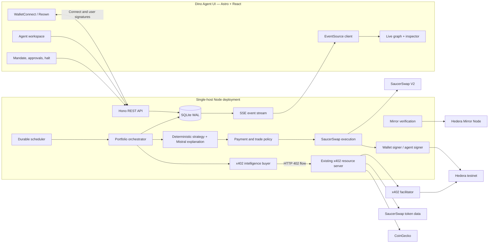
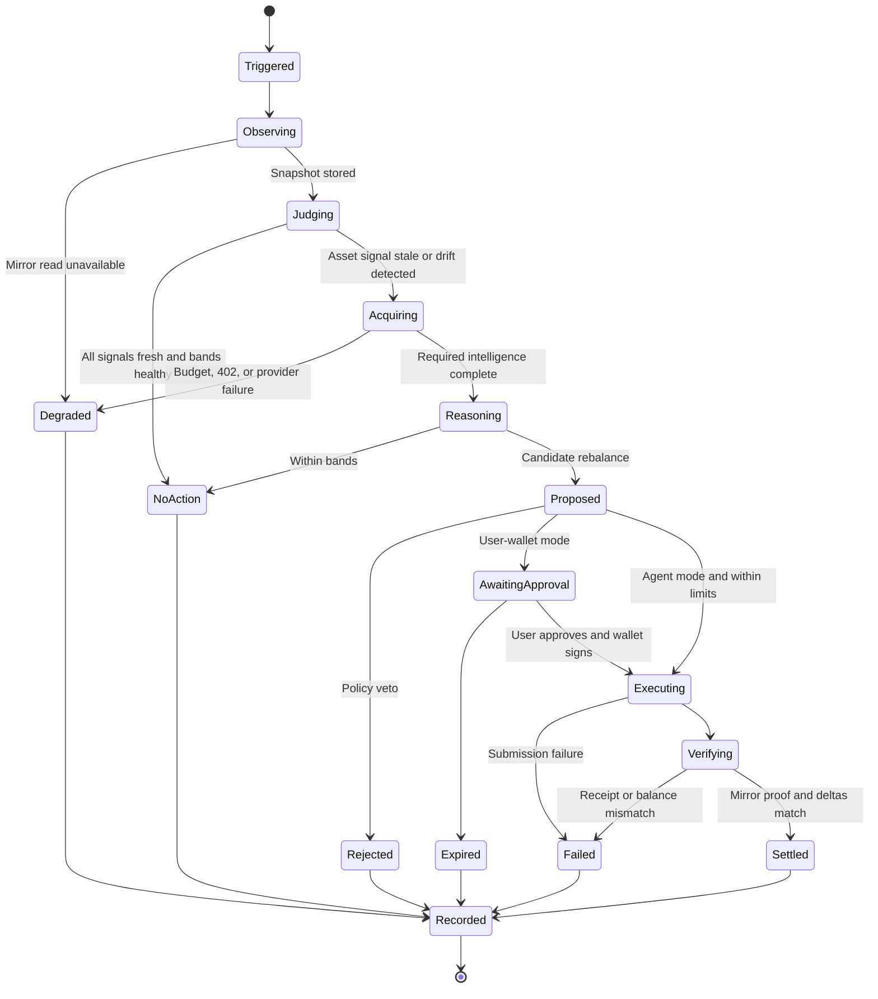

# Dino Agent — Autonomous Multi-Asset Portfolio Manager

## 1. Summary and success criteria

Replace the current MarketRail dashboard with the supplied Agent Ledger/Dino Agent interface, preserving its layout, visual language, interaction model, event rail, graph, inspector, approvals, spend ledger, autonomy controls, and responsive behavior. Remove all scripted demo behavior and wire every visible state to real backend data.

The finished testnet product will support two separate portfolio profiles:

- **User Wallet:** reads a connected Hedera wallet, analyzes it continuously, and prepares trades that the user signs.
- **Autonomous Agent:** manages HBAR, USDC, and SAUCE held in a dedicated, deliberately funded Hedera account; trades execute unattended only within deterministic limits.

Success means:

- All three assets are read from Hedera and valued with paid x402 intelligence.
- The agent maintains user-defined allocation bands plus an optional natural-language objective.
- Data acquisition is adaptive per asset and budget-aware.
- Actual x402 `402 → payment → retry → data` transactions settle on Hedera.
- Actual SaucerSwap quotes and swaps replace HBAR-transfer placeholders.
- Scheduler state, runs, events, proposals, receipts, budgets, and portfolio snapshots survive process restarts.
- SSE streams the complete lifecycle into the Dino Agent UI.
- Every claimed payment and trade has a verified Mirror Node result and HashScan link.
- Fallback market data is visibly labeled and may inform a cautious analysis, but can never authorize a trade.
- No fake wallet connections, random prices, fabricated transactions, timers, demo holdings, or silent portfolio fallbacks remain.

## 2. Target architecture



The existing x402 v2 implementation remains the commercial data rail. Its standardized `PAYMENT-REQUIRED`, `PAYMENT-SIGNATURE`, and `PAYMENT-RESPONSE` lifecycle becomes the source of payment events and receipts shown in the UI. [x402 v2 HTTP 402 documentation](https://docs.x402.org/core-concepts/http-402)

Use one deployable Node service:

- Build Astro to static assets and serve them from Hono on the same origin.
- Run the API, SSE broadcaster, scheduler, orchestration worker, and x402 resource server in one process.
- Use SQLite in WAL mode with migrations and a persistent host volume.
- Recover due scheduler work, incomplete runs, and pending proposals on startup.
- Add graceful shutdown so active jobs stop at a safe state boundary.
- Configure the reverse proxy for TLS, disabled SSE buffering, long-lived connections, and 15-second heartbeats.

## 3. Portfolio and custody model

### Portfolio profiles

Create an explicit `PortfolioProfile` abstraction:

```ts
type PortfolioProfile = {
  id: string;
  name: string;
  kind: "user_wallet" | "agent_managed";
  network: "hedera:testnet";
  accountId: string;
  autonomyMode: 1 | 2 | 3 | 4;
  status: "active" | "paused" | "halted" | "degraded";
  mandateId: string;
};
```

- `user_wallet` supports modes 1–3:
  - Observe.
  - Advise.
  - Propose and wait for a wallet signature.
- `agent_managed` supports modes 1–4:
  - Mode 4 can execute autonomously with the dedicated server signer.
- The connected user wallet and agent-managed account remain separate in navigation, history, spending, holdings, and receipts.
- The connected wallet may fund or withdraw from the agent account, but this is presented as an explicit transfer—not as an invisible aggregation.
- Mode 4 requires a confirmation screen explaining that only assets transferred into the agent account are autonomously managed.

### Wallet authentication and approvals

Use the current `@hashgraph/hedera-wallet-connect` Reown AppKit integration with both native Hedera and EVM-compatible adapters. The current package recommends AppKit for new applications and supports native `hedera_signAndExecuteTransaction`. [Hedera WalletConnect package documentation](https://www.npmjs.com/package/%40hashgraph/hedera-wallet-connect)

Connection flow:

1. Browser requests a short-lived server nonce.
2. Wallet connects on `hedera:testnet`.
3. User signs the nonce to prove control of the selected account.
4. Backend verifies the signature against the account public key and creates an HTTP-only, same-site session cookie.
5. Account/network changes invalidate cached profile data.
6. Disconnect removes the session and immediately prevents new approval preparation.

For a user-wallet trade:

1. User approves the proposal in Dino Agent.
2. Server revalidates policy and obtains a fresh SaucerSwap quote.
3. Server returns a sequence of serialized transactions:
   - Output-token association, if missing.
   - Exact input-token allowance, if required.
   - Swap contract execution.
4. Browser presents each required wallet signature in order.
5. Browser returns transaction IDs.
6. Backend independently verifies every transaction and balance delta before marking the proposal settled.

For the agent-managed profile, the same transaction builder is used, but a server-side `AgentSigner` signs and submits without browser interaction. Keep the signer behind an interface so the testnet environment key can later move from an environment secret to KMS/HSM without changing orchestration code.

## 4. Mandates, risk limits, and autonomous decisions

### User-defined mandate

Each profile receives:

```ts
type PortfolioMandate = {
  objective?: string;
  allocations: Array<{
    symbol: "HBAR" | "USDC" | "SAUCE";
    tokenId: string;
    minPct: number;
    targetPct: number;
    maxPct: number;
  }>;
  risk: {
    maxTradePct: number;
    maxPortfolioMovePct: number;
    maxSlippageBps: number;
    maxPriceImpactBps: number;
    maxTradesPerDay: number;
    maxDailyTradePct: number;
    maxDailyDataHbar: string;
    minTradeUsd: string;
  };
  cadenceMinutes: number;
};
```

Validation:

- Target allocations total exactly 100%.
- `minPct ≤ targetPct ≤ maxPct`.
- Only HBAR, USDC, and SAUCE/token IDs for the configured network are accepted.
- User limits can be tighter than server backstops, never looser.
- Updating a mandate creates a versioned record so every run points to the exact policy in force.
- Mode 4 cannot be enabled until the mandate, limits, account funding, token associations, signer readiness, and kill switch are all valid.

Initial conservative defaults:

- Maximum trade: 5% of portfolio value.
- Maximum portfolio movement per run: 5%.
- Maximum one settled swap per cycle.
- Maximum six trades per UTC day.
- Maximum cumulative daily trade value: 15% of the starting daily portfolio value.
- Maximum slippage: 1%.
- Maximum quoted price impact: 2%.
- Data ceiling: 0.5 HBAR per UTC day.
- Pending proposal lifetime: 90 seconds.
- Swap deadline: 60 seconds from final re-quote.

### Decision ownership

Mistral must not decide arbitrary amounts, token IDs, routes, or policy exceptions.

- A deterministic rebalancer computes deviations from allocation bands.
- It proposes movement from the most overweight asset toward the most underweight asset.
- Routes are restricted to HBAR/USDC and HBAR/SAUCE; USDC/SAUCE uses HBAR as an intermediate route only when the quoted combined route passes policy.
- At most one swap executes per cycle; the next cycle re-reads balances before considering another.
- Mistral receives the portfolio, paid intelligence, mandate, candidate trade, and policy outcome to produce a structured explanation and confidence assessment.
- Invalid or unavailable model output falls back to deterministic explanation without changing the candidate trade.
- Trades are blocked when:
  - A required portfolio or market input is stale/fallback.
  - A paid response lacks verified settlement.
  - No live SaucerSwap quote exists.
  - The quote, balance, allowance, association, or mandate changed.
  - Any cumulative budget or frequency limit is exceeded.
  - The global or profile kill switch is active.
  - The candidate would leave another asset outside a hard safety floor.
  - The agent account lacks fees plus the proposed input amount.

## 5. End-to-end orchestration



Each scheduler cycle:

1. Acquire a database lease keyed by profile and intended execution time.
2. Create a run with an idempotency key; duplicate ticks cannot create duplicate payments or swaps.
3. Read HBAR and HTS balances from the Mirror Node.
4. Resolve token metadata/decimals and reject unsupported or suspicious token records.
5. Store an immutable portfolio snapshot. Mirror failures use the last snapshot only as visibly stale context; no fabricated holdings are created.
6. Evaluate per-asset intelligence freshness:
   - Spot price: 60 seconds.
   - Executable quote: 30 seconds.
   - OHLC/momentum: 5 minutes.
7. For each stale HBAR, USDC, or SAUCE signal, run the existing real x402 client flow against the protected resource endpoint.
8. Enforce per-cycle and daily data budgets before signing each payment.
9. Store the decoded 402 terms, payment policy result, settlement response, transaction ID, HashScan URL, provider provenance, and returned dataset.
10. If a base signal cannot be obtained for all portfolio assets, stop with a degraded analysis.
11. Build USD values and allocation percentages using one consistent valuation timestamp.
12. Run the deterministic allocation-band evaluator.
13. If no action is required, record why and schedule the next cycle without buying deeper intelligence.
14. If action may be required, adaptively purchase deeper quote/OHLC intelligence only for the candidate route’s assets.
15. Generate a trade candidate and request a live SaucerSwap V2 quote.
16. Apply trade policy and cumulative-ledger checks.
17. Route to approval or autonomous execution.
18. Re-quote immediately before execution; approval authorizes policy bounds, not a stale exact price.
19. Submit required association, allowance, and swap transactions.
20. Poll the Mirror Node until consensus status is terminal.
21. Verify contract result, input/output token transfers, expected account, minimum output, and resulting balances.
22. Store the post-trade portfolio snapshot and publish the final receipt.
23. Calculate the next due time from the persisted schedule rather than from process uptime.

### Adaptive x402 acquisition

Refactor the existing single-asset runner so x402 purchasing becomes a reusable `IntelligenceBuyer`:

```ts
buy({
  runId,
  profileId,
  symbol,
  product: "spot-price" | "quote" | "ohlc",
  params,
  maxAmountAtomic,
  idempotencyKey,
}): Promise<PurchasedIntelligence>
```

- Continue using the existing catalog, payment validation, Hedera signer boundary, facilitator integration, settlement parsing, and HashScan construction.
- Remove random purchase amounts and mock transaction IDs from `multi-runner.ts`.
- Always make a real HTTP request through the payment middleware; do not bypass x402 with an internal provider call.
- Require distinct configured x402 payer and resource payee accounts.
- Extend the market provider:
  - HBAR and USDC use the existing CoinGecko-backed products.
  - SAUCE uses the SaucerSwap token/price API normalized into the same provider contract.
  - All three remain purchasable through the same x402 catalog.
- Preserve labeled deterministic market fallback as requested, but tag it `fallback` and make the trade policy reject any proposal whose valuation or route depends on it.
- Do not allow fallback for balances, x402 settlements, executable quotes, transaction status, or post-trade verification.

## 6. SaucerSwap integration

Use SaucerSwap V2 on testnet:

- Resolve current testnet router, quoter, WHBAR, HBAR conversion, pool, and token IDs from configuration verified against official deployments at startup. The currently documented testnet V2 router is `0.0.1414040` and QuoterV2 is `0.0.1390002`; keep these configurable rather than scattered through code. [SaucerSwap contract deployments](https://docs.saucerswap.finance/developerx/contract-deployments)
- Use QuoterV2 `quoteExactInput` for executable route estimates and gas estimates. HBAR paths use WHBAR in encoded routes. [SaucerSwap V2 quote documentation](https://docs.saucerswap.finance/v/developer/saucerswap-v2/swap-operations/swap-quote)
- Encode `exactInput` parameters using `ethers.Interface`, then submit them in a Hedera `ContractExecuteTransaction`.
- Calculate `amountOutMinimum` from the fresh quote and configured slippage limit.
- Check target-token association and router allowance before execution; SaucerSwap’s documented token swap flow requires both. [SaucerSwap V2 token swap documentation](https://docs.saucerswap.finance/v/developer/saucerswap-v2/swap-operations/swap-tokens-for-tokens)
- Approve only the exact token amount needed for the trade. Revoke unused allowance when a later step fails.
- Store route tokens, fee tiers, pool identifiers, expected output, minimum output, gas estimate, price impact, quote timestamp, deadline, and encoded-call hash.
- Replace `executeHbarTransfer` entirely as the trade implementation. A plain transfer must never be displayed as a swap.
- Verify actual output from contract records and token-transfer deltas, not only the SDK receipt status.

## 7. Persistence and event model

Replace `data/store.json` with migrated SQLite tables:

- `sessions`
- `portfolio_profiles`
- `wallet_connections`
- `mandates`
- `schedules`
- `scheduler_leases`
- `runs`
- `run_events`
- `portfolio_snapshots`
- `intelligence_cache`
- `data_purchases`
- `trade_proposals`
- `trade_quotes`
- `trade_executions`
- `transaction_proofs`
- `daily_ledgers`
- `system_state`

Use integer atomic units or decimal strings for HBAR/token quantities; never JavaScript floating-point numbers for settlement, limits, or balance comparisons.

Every state transition inserts an append-only event in the same database transaction as the domain update:

```ts
type RunEvent = {
  id: string;
  sequence: number;
  runId: string;
  profileId: string;
  kind:
    | "run.triggered"
    | "portfolio.observed"
    | "intelligence.judged"
    | "payment.required"
    | "payment.authorized"
    | "payment.settled"
    | "intelligence.received"
    | "strategy.reasoned"
    | "trade.proposed"
    | "trade.blocked"
    | "trade.awaiting_approval"
    | "trade.submitted"
    | "trade.verified"
    | "run.no_action"
    | "run.degraded"
    | "run.failed"
    | "run.completed";
  occurredAt: string;
  provenance: "live" | "cached" | "fallback";
  payload: unknown;
};
```

- SSE publishes committed database events, never pre-commit in-memory objects.
- Event IDs and sequence numbers support replay and reconnect.
- `Last-Event-ID` resumes from the next durable event.
- The initial SSE connection sends a profile snapshot, current run, pending approvals, scheduler status, and the latest graph window.
- Retain full financial/protocol events; summarize only their UI presentation.
- Redact private keys, raw signatures, API keys, authorization cookies, and unnecessary payment payload bytes.

## 8. Public API and streaming contracts

Use versioned, runtime-validated request/response schemas:

- `POST /api/v1/auth/challenge`
- `POST /api/v1/auth/verify`
- `DELETE /api/v1/session`
- `GET /api/v1/profiles`
- `POST /api/v1/profiles/user-wallet`
- `GET /api/v1/profiles/:profileId`
- `PATCH /api/v1/profiles/:profileId/mandate`
- `PATCH /api/v1/profiles/:profileId/schedule`
- `POST /api/v1/profiles/:profileId/runs`
- `GET /api/v1/profiles/:profileId/runs`
- `GET /api/v1/runs/:runId`
- `GET /api/v1/profiles/:profileId/portfolio`
- `GET /api/v1/profiles/:profileId/stream`
- `GET /api/v1/proposals/:proposalId`
- `POST /api/v1/proposals/:proposalId/approve`
- `POST /api/v1/proposals/:proposalId/prepare`
- `POST /api/v1/proposals/:proposalId/confirm`
- `POST /api/v1/proposals/:proposalId/reject`
- `POST /api/v1/system/halt`
- `POST /api/v1/system/resume`
- `GET /api/v1/health`
- Existing `/catalog` and `/data/:product` x402 endpoints remain compatible.

Require an idempotency key for manual runs, approvals, trade preparation, confirmation, halt, and resume operations.

The global kill switch:

- Persists `halted=true` before acknowledging success.
- Cancels scheduled jobs and marks pending proposals expired.
- Aborts orchestration before the next irreversible action.
- Blocks new x402 signatures and trade submissions.
- Does not claim to reverse a payment or swap already submitted.
- Requires an explicit authenticated resume action.

## 9. Dino Agent UI replacement

Use Agent Ledger.zip as the production UI base with minimal visual change.

### Preserve

- Dino Agent name and Dino mark.
- Light-first Cloud White/Signal design system.
- Header layout and compact connected-account pill.
- Workspace/run rail.
- Autonomy dial and limit editor.
- Live event-card stream.
- “Right now” thinking trace.
- Live graph/trace inspector.
- Proposal gate with countdown.
- Receipts and HashScan proof presentation.
- Spend ledger.
- Watch status and cadence control.
- Global kill switch.
- Composer for objective updates/manual runs.
- Responsive behavior, keyboard focus, reduced-motion handling, and compact information density.

The frontend-design guidance results in preserving the supplied interface’s distinct operational-console personality instead of redesigning it into another generic dashboard.

### Remove

- `agent-script.ts`.
- Timer-driven `use-agent-run.ts`.
- Random price ticks and transaction hashes.
- Hard-coded `ACCOUNT`, holdings, limits, spend, and ledger rows.
- LocalStorage fake connection.
- “Connect demo wallet” behavior.
- All “mock data,” “demo account,” “replay demo,” and simulated settlement copy.
- `VariantSwitcher` and design-gallery variants from the production build.
- The current replacement `DashboardApp` implementation and its hard-coded local fallbacks.
- Any UI branch that treats a failed request as a successful local simulation.

### Wire to real services

Introduce:

- `useWalletSession()` for Reown/Hedera connection and signed authentication.
- `useProfiles()` and a profile selector for User Wallet vs Autonomous Agent.
- `usePortfolio(profileId)` for balances, allocations, mandate, and provenance.
- `useAgentStream(profileId)` using native `EventSource`, replay, reconnect, and sequence deduplication.
- `useRunHistory(profileId)` for paginated runs.
- `useProposal(id)` for expiry, approval, signing steps, and verification.
- `useSchedule(profileId)` for pause/cadence controls.
- `useSystemState()` for global halt/degraded status.
- `useSpendLedger(profileId)` for data spend, trade volume, and network fees.

Use TanStack Query for REST caching/mutation invalidation and native EventSource for live events. The SSE reducer updates the same query cache, so reload/reconnect and live state converge on one model.

### Workspace behavior

- Header profile pill shows actual account, custody type, network, connection status, and live/degraded state.
- Left rail switches profiles and displays real runs, pending approvals, and spend totals.
- Center stream renders persisted lifecycle events from the server.
- Inspector graph supports:
  - Portfolio value.
  - Asset allocation.
  - HBAR/USDC/SAUCE prices.
  - Target bands.
  - x402 purchase markers.
  - Proposal and settlement markers.
- Every chart point exposes `live`, `cached`, `stale`, or `fallback` provenance.
- Approval cards display input, expected/minimum output, slippage, price impact, route, policy result, expiry, and required wallet steps.
- Receipts distinguish data purchases from SaucerSwap trades.
- Empty states teach the user how to connect, fund the agent account, set allocation bands, and enable a schedule.
- On mobile, approvals, halt, portfolio status, and current agent action remain accessible; the inspector becomes a full-height sheet.

## 10. Testing and validation

### Unit tests

Add exhaustive tests for:

- Mandate schema, allocation totals, bands, and server backstops.
- Atomic-unit conversions and decimal handling for HBAR, USDC, and SAUCE.
- Adaptive acquisition freshness and budget prioritization.
- x402 challenge validation and per-asset purchase idempotency.
- Allocation-band calculations and deterministic candidate generation.
- Pair allowlists, balance checks, daily caps, frequency caps, slippage, price impact, fallback/staleness vetoes, mode mismatches, and halt behavior.
- SaucerSwap route encoding/decoding and `amountOutMinimum`.
- Token-association and allowance planning.
- Proposal expiry and re-quote rules.
- Event ordering, SSE reducer deduplication, and graph-series construction.
- Scheduler lease acquisition, missed-run recovery, and duplicate suppression.

### Integration tests

Use controlled HTTP fixtures for external services while retaining the real internal boundaries:

- Mirror account/token pagination, metadata, transaction, contract-result, and outage cases.
- CoinGecko and SaucerSwap live/fallback normalization.
- Real application-level x402 `402 → sign → 200` flow for HBAR, USDC, and SAUCE.
- Payment settlement parsing and exact ledger accounting.
- SQLite migration, restart recovery, concurrent writes, and UTC daily resets.
- SSE initial sync, heartbeat, ordered delivery, reconnect with `Last-Event-ID`, and replay.
- Scheduler-to-orchestrator execution and global halt.
- User-wallet transaction preparation and confirmation verification.
- Agent signer rejection when policy is exceeded.
- SaucerSwap quote response decoding and simulated contract records with exact token deltas.

### UI and browser tests

Use React Testing Library plus Playwright:

- Connect, account/network change, disconnect, and session expiry.
- Create/edit a mandate and validate bands.
- Switch between user-wallet and agent-managed profiles.
- Watch an SSE run update the event stream and graph without refresh.
- Approve, reject, expire, and re-quote a proposal.
- Wallet signature rejection and partial multi-step signing failure.
- Enable/disable scheduling and confirm persisted state after reload.
- Halt during observation, acquisition, approval, and immediately before execution.
- Restore UI state after SSE disconnect and full page reload.
- Verify no demo/fake labels or hard-coded account data remain.
- Keyboard navigation, focus restoration, responsive layouts, contrast, and reduced motion.

### Gated live-testnet acceptance suite

Run separately from offline CI using funded test accounts:

1. Read real HBAR, USDC, and SAUCE balances from Mirror Node.
2. Purchase one real x402 product for each asset.
3. Verify all three Hedera payment transactions and exact payee credits.
4. Obtain a real SaucerSwap quote.
5. Associate required tokens on a fresh account.
6. Execute a minimal HBAR→USDC or HBAR→SAUCE swap.
7. Verify contract status and exact balance deltas through Mirror Node.
8. Execute the reverse route when testnet liquidity permits.
9. Confirm the UI receives the complete event sequence through SSE.
10. Restart the process and confirm schedule, history, ledgers, and receipts remain intact.

The release gate fails if any “settled” UI state lacks a verified transaction ID, HashScan URL, matching account, matching amount, and successful Mirror Node proof.

## 11. Implementation sequence

1. **Stabilize the baseline**
   - Preserve the current user changes.
   - Keep the presently passing 37 tests and successful typecheck/build as regression baselines.
   - Mark all prototype multi-asset paths as non-production until mocks are removed.

2. **Domain and persistence**
   - Introduce profiles, mandates, atomic values, runs, events, proposals, quotes, executions, and SQLite migrations.
   - Replace JSON persistence and floating-point financial state.

3. **Real portfolio and identity**
   - Implement WalletConnect authentication, separate profiles, Mirror pagination, metadata resolution, and agent-account readiness checks.
   - Remove fabricated portfolio fallback.

4. **Reusable x402 intelligence buyer**
   - Extract the working payment loop from the original agent runner.
   - Add HBAR/USDC/SAUCE acquisition, adaptive freshness, budgets, durable receipts, and fallback provenance.

5. **Deterministic strategy and policy**
   - Implement allocation bands, candidate generation, cumulative ledgers, modes, escalation, and fallback/stale-data vetoes.
   - Keep Mistral as structured analysis/explanation.

6. **SaucerSwap quote and execution**
   - Implement V2 routing, quotes, associations, allowances, transaction construction, both signer paths, and Mirror verification.
   - Delete the HBAR-transfer-as-swap implementation.

7. **Durable scheduler and SSE**
   - Add persisted due times, run leases, restart recovery, kill switch, append-only events, replay, and reconnect.

8. **UI port and integration**
   - Port the Agent Ledger component tree and styles into the existing Astro React surface.
   - Replace every scripted state with REST/SSE/WalletConnect data while keeping the visual presentation nearly unchanged.

9. **End-to-end hardening**
   - Complete offline, browser, failure-mode, restart, and gated live-testnet tests.
   - Run preflight and produce fresh x402 and SaucerSwap HashScan proofs.
   - Update README, environment example, operator runbook, and demo/recovery documentation.

## 12. Required inputs and external setup

To implement and run everything end to end, the following will be needed. Secrets should be placed directly in the local/deployment environment, not pasted into chat:

- A Reown/WalletConnect project ID and the final HTTPS application origin.
- A dedicated ECDSA Hedera testnet agent account and private key, funded with:
  - HBAR for fees, x402 payments, and test swaps.
  - Testnet USDC and SAUCE for reverse-route testing.
- A separate x402 resource payee account; the buyer and seller must not be the same account.
- Confirmation that the existing Blocky402 facilitator credentials/URL remain valid.
- A SaucerSwap API key for authenticated token/market REST access.
- The existing Mistral API key.
- At least one testnet wallet account available through HashPack, Kabila, or another compatible wallet for approval-flow testing.
- A single host with Node 20+, HTTPS/domain configuration, and a persistent writable volume for SQLite.
- Final user-facing allocation-band presets if the conservative defaults above should be changed.

No database service, Redis instance, WebSocket provider, HashScan key, or contract deployment is required for this single-host testnet version. SaucerSwap contract IDs, Hedera token metadata, and Mirror Node endpoints can be resolved and verified from official sources during implementation.
